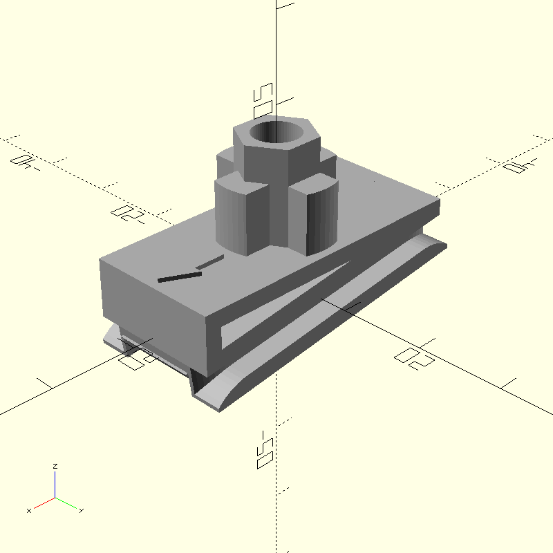

# Fender Mounts

In this project,
we wanted to fit mountain bike fenders onto a fatbike, so we

* measured the mounts of SKS Shockblade fenders or mudguards,
* built a parametric model of the mounts,
* augmented the model with the option to adjust the angle,
* 3d-printed the augmented model and
* treated the print with acetone vapor.

We should also note that "we" refers to Sampsa Kiiskinen,
the sole author of this project.

## Options

There are long and short variations of the model and
the angle is adjustable from 0 to 89 degrees.
